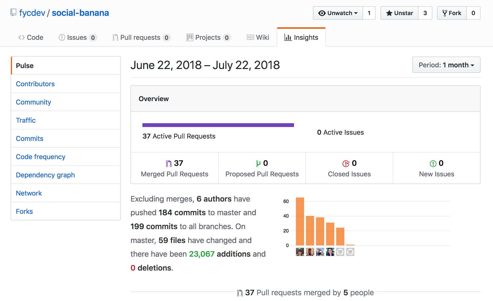

# WELCOME TO THE SOCIAL BANANA APPLICATION

## **PART B - PROJECT**

~ _a group project designed, created and developed by Coder Academy students_ ~

**Realista's Website:**

https://www.realista.com.au/

**Group Prototype:**

[ INSERT FINAL WEBSITE HERE] <<---

---

## **CONTENTS**

---

- **[Project Outline](#Project_Outline)**
  - [Specifications](#Specifications)
  - [Client Objective](#Client_Objective)
  - [Our Objective](#Our_Objective)
- **[Project Management](#Project_Management)**
  - [Tools & Resources](#Tools_and_Resources)
  - [Diary Entries](#Diary_Entries)
  - [Client Interraction](#Client_Interraction)
- **[User Stories](#User_Stories)**
- **[Workflow](#Workflow)**
- **[ERD](#ERD)**
- **[Wireframes](#Wireframes)**
  - [Proposed Wireframes from Client](#Proposed_Wireframes_from_Client)
  - [Initial Whiteboard Wireframes](#Initial_Whiteboard_Wireframes)
  - [Our Wireframes](#Our_Wireframes)
- **[Challenges](#Challenges)**
- **[Code Reviews](#Code_Reviews)**
- **[Improvements](#Improvements)**
- **[Final Review](#Final_review)**

---

## **PROJECT OUTLINE**

---

### **SPECIFICATIONS**

Following CA's assignment guidelines and specifications, aswell as implementing our client's specifications:

### Tech stack:

    Front-end
    - Pure css styling
    - React
    - Javascript

    Back-end
    - Express
    - MongoDB/Mongoose
    - Node.js
    - Jest.js

### **CLIENT OBJECTIVE**


To create a service that allows the automation of sharing listings to an agent’s connected social media channels will generate additional exposure of the Realista brand, increase faith and loyalty in the brand, and drive signups for new agents and potential buyers and sellers.

### **OUR OBJECTIVE**

We strive to design, build, test and deploy a microservice web application prototype in order to assist Realista’s business objectives.

---

## **PROJECT MANAGEMENT**

---

### **TOOLS & RESOURCES**

Documenting

- Agile - Google Sheets
- Adobe InDesign
- Trello
  - [Development Board](https://trello.com/b/LNKpuZFz/development#)
- Dropbox

Resources

- Linked in Docs
  - [Developers guide](https://developer.linkedin.com/)
- React
  - [React docs](https://reactjs.org/docs/getting-started.html)
  - [Alligator - _'Index.js for Interfaces'_](https://alligator.io/react/index-js-public-interfaces/)
  - [Medium - _'React App with Webpack'_](https://medium.freecodecamp.org/part-1-react-app-from-scratch-using-webpack-4-562b1d231e75?source=userActivityShare-771256f05c68-1531790077)
- OAuth
  - [OAuth 2.0 docs](https://oauth.net/2/)
  - [Youtube - _'OAuth all things!'_](https://www.youtube.com/watch?v=wA4kqKFua2Q)
- Authentication
  - [Dzone - _'Cookies vs Tokens'_](https://dzone.com/articles/cookies-vs-tokens-the-definitive-guide)
  - [Pony foo - _'Cookies vs Tokens'_](https://ponyfoo.com/articles/json-web-tokens-vs-session-cookies)
  - [Okta - _'JWT tokens'_](https://developer.okta.com/blog/2017/08/17/why-jwts-suck-as-session-tokens)
- GitHub
  - [Atlassian Blog - _'Gitflow guide'_](https://www.atlassian.com/blog/git/simple-git-workflow-simple)
- Heroku
  - [Medium - _'Deploying MERN stack to Heroku'_](https://medium.freecodecamp.org/how-to-make-create-react-app-work-with-a-node-backend-api-7c5c48acb1b0)
  - [Dave Ceddia - _'Deploy React & Express to Heroku'_](https://daveceddia.com/deploy-react-express-app-heroku/)
  - [Heroku - _'Review Apps'_](https://devcenter.heroku.com/articles/github-integration-review-apps)
  - [Heroku - _'Node.js Support'_](https://devcenter.heroku.com/articles/nodejs-support)
  - [Heroku - _'Configuration & Config Vars'_](https://devcenter.heroku.com/articles/nodejs-support)

### **DIARY ENTRIES**

We are using the Scrum Framework to implement the Agile Methodology. The product owner role will be shared with each group member so we can have group discussions on the priorities required for the application and have group conversations with the client. One person will be assigned a scrum master role to control the flow of the sprints.

Using Trello, we have marked what tasks are individually pending, ongoing and completed. We have created planning and development scrum boards in order to implement agile practices. Within the limited timeframes, we’ve set the specific timeline and kept tracking the progress. It’s been a very useful tool to find if we’ve been doing alright and how far we are from acheiving our team goals.

In addition to Trello, we created a diary entry spreadsheet using [Google Sheets](https://www.google.com.au/sheets/about/) to make record keeping more personalized and easier for the group to have an overview of each student's progress.

This makes it easier to view, instead of going through each card to view each students current working schedule.

Link to our [Project Timeline Spreasheet.](https://docs.google.com/spreadsheets/d/1MWITXu66A347u9xMUXWBpSEvMRnZhnHQogPxvelMMBg/edit?usp=sharing)

We’ve also decided to do daily standups based on the project timeline sheet Barbara made for the team.

We have had a 15 minute team meeting every morning with the following topics and shared some feedback for any ongoing tasks or matters. When there are new things to work on for everyone, pairing up to work on the shared parts has been helpful.

- what we accomplished since the last standup
- what we’ll accomplish between now and the next standup
- anything that’s holding up our progress

### **CLIENT INTERRACTION**

We've communicated with our client - Realista - via Facebook Messenger, in which the group was added to a group chat for access to some of their resources and proposed wireframes.

During our initial meeting, we presented a brief to the client to ensure they are aware of our project guidelines and timeframe.

A breakdown of what was presented on the client brief is as below:

- Who we are
- Client Goal
- What to expect
- Timeline
- Handoff/Feedback
- Questions

Client meeting notes:

- 
- 

---

## **USER STORIES**

---

**[Trello - User Stories Board](https://trello.com/b/OMLvE5IV/user-stories#)**


---

## **WORKFLOW**

---

**[Figma - Workflow](https://www.figma.com/file/WDdu8FSBSO1juNfeJpUYcniA/Realista?node-id=0%3A1)**


---

## **ERD**

---

```javascript
const UserSchema = new mongoose.Schema({
  firstName: String,
  lastName: String,
  mobileNumber: String,
  agency: String,
  bioDescription: String,
  officeAddress: String,
  operatingLocations: [String],

  email: {
    type: String,
    required: true,
    trim: true,
    unique: true,
    validate: {
      validator: (value) => {
        return validator.isEmail(value);
      },
      message: '{VALUE} is not a valid email'
    }
  },
  password: {
    type: String,
    required: true,
    minlength: 6
  },
  authTokens: [String],

  socials: {
    linkedin: {
      username: String,
      linked: Boolean,
      toggleStatus: Boolean,
      access_token: String
    },
    twitter: {
      username: String,
      linked: Boolean,
      toggleStatus: Boolean,
      access_token: String,
      access_token_secret: String
    },
    facebook: {
      username: String,
      linked: Boolean,
      toggleStatus: Boolean,
      access_token: String
    }
  }
});
```

---

## **WIREFRAMES**

---

### **PROPOSED WIREFRAMES FROM CLIENT**

**Social Media Linking Page**


**Sharing Listing Page**


### **INITIAL WHITEBOARD WIREFRAMES**


### **OUR WIREFRAMES**


---

## **CHALLENGES**

---

| Student     |                                                       Issue/s                                                       | Resolved? (Y/N) |
| ----------- | :-----------------------------------------------------------------------------------------------------------------: | --------------: |
| **Mark**    |                            - setting up http testing. Doesn't close server when finished                            |                 |
|             |                                       - conditional rendering the login page                                        |                 |
|             |                                           - redirecting from the backend                                            |                 |
| **Serina**  | - network error: login window is frozen or displays invalid combination with correct input data when connected with |                 |
| **Jake**    |                  - Images can't be imported into React components if they have any capital letters                  |                 |
| **Barbara** |                        - Issues rebasing branch with conflicting files in components and css                        |                 |
|             |                              - unable to deploy successfully on heroku-test-deployment                              |                 |
| **Franky**  |                                                          -                                                          |                 |

---

## **CODE REVIEWS**

---

Prior to initializing our first pull request on Github, our app was optimized to work as a 'Review App' - which is a disposable Heroku App with a unique URL.

Our app was set to refresh on Heroku automatically for each pull request, thus allowing us to propose, test, and merge changes to our code base.

More information can be found be clicking [here.](https://devcenter.heroku.com/articles/github-integration-review-apps)

Furthermore, code reviews on Github were conducted by all members of the group. This was a great learning experience, as it provides the student an insight on how to evaluate another developers code when working in future group/team projects.

Insights to our merges, commits, PR's and overall project flow can be found at
**[Social-Banana - Github Insights.](https://github.com/fycdev/social-banana/pulse)**


_Screenshot taken on 23 July 2018_

---

## **IMPROVEMENTS**

---

- Show previous search entries when users enter the first few letters of city name

## **FINAL REVIEW**

---

    [ NEEDS TO BE COMPLETED ]

## **CONTRIBUTERS**

---

This project wouldn't have been possible without the strong efforts and dedication of the following developers:

- Jake - [Github](https://github.com/JakePitman)
- Franky - [Github](https://github.com/fycdev)
- Serina - [Github](https://github.com/crushoncode)
- Mark - [Github](https://github.com/marktice)
- Barbara - [Github](https://github.com/barbs89)
