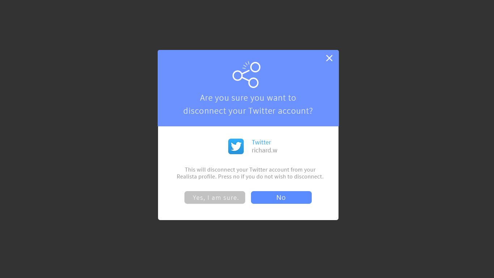

# WELCOME TO THE SOCIAL BANANA APPLICATION

## **PART B - PROJECT**

~ _a group project designed, created and developed by Coder Academy students_ ~

**Realista's Website:**

https://www.realista.com.au/

**Group Prototype:**

[ INSERT FINAL WEBSITE HERE] <<---

---

## **CONTENTS**

---

- **[Project Outline](#Project_Outline)**
  - [Specifications](#Specifications)
  - [Client Objective](#Client_Objective)
  - [Our Objective](#Our_Objective)
- **[Project Management](#Project_Management)**
  - [Tools & Resources](#Tools_and_Resources)
  - [Diary Entries](#Diary_Entries)
  - [Client Interraction](#Client_Interraction)
- **[User Stories](#User_Stories)**
- **[Workflow](#Workflow)**
- **[ERD](#ERD)**
- **[Wireframes](#Wireframes)**
  - [Proposed Wireframes from Client](#Proposed_Wireframes_from_Client)
  - [Initial Whiteboard Wireframes](#Initial_Whiteboard_Wireframes)
  - [Our Wireframes](#Our_Wireframes)
- **[Problems & Solutions](#Problems_and_Solutions)**
- **[Improvements](#Improvements)**
- **[Final Review](#Final_review)**

---

## **PROJECT OUTLINE**

---

### **SPECIFICATIONS**

Following CA's assignment guidelines and specifications, aswell as implementing our client's specifications:

### Tech stack:

    Front-end
    - Pure css styling
    - React
    - Javascript

    Back-end
    - Express
    - MongoDB/Mongoose
    - Node.js
    - Jest.js

### **CLIENT OBJECTIVE**


To create a service that allows the automation of sharing listings to an agent’s connected social media channels will generate additional exposure of the Realista brand, increase faith and loyalty in the brand, and drive signups for new agents and potential buyers and sellers.

### **OUR OBJECTIVE**

We strive to design, build, test and deploy a microservice web application prototype in order to assist Realista’s business objectives.

---

## **PROJECT MANAGEMENT**

---

### **TOOLS & RESOURCES**

Documenting

- Agile - Google Sheets
- Adobe InDesign
- Trello
  - [Development Board](https://trello.com/b/LNKpuZFz/development#)
- Dropbox

Resources

- Linked in Docs
  - [Developers guide](https://developer.linkedin.com/)
- React
  - [React docs](https://reactjs.org/docs/getting-started.html)
  - [Alligator - _'Index.js for Interfaces'_](https://alligator.io/react/index-js-public-interfaces/)
  - [Medium - _'React App with Webpack'_](https://medium.freecodecamp.org/part-1-react-app-from-scratch-using-webpack-4-562b1d231e75?source=userActivityShare-771256f05c68-1531790077)
- OAuth
  - [OAuth 2.0 docs](https://oauth.net/2/)
  - [Youtube - _'OAuth all things!'_](https://www.youtube.com/watch?v=wA4kqKFua2Q)
- Authentication
  - [Dzone - _'Cookies vs Tokens'_](https://dzone.com/articles/cookies-vs-tokens-the-definitive-guide)
  - [Pony foo - _'Cookies vs Tokens'_](https://ponyfoo.com/articles/json-web-tokens-vs-session-cookies)
  - [Okta - _'JWT tokens'_](https://developer.okta.com/blog/2017/08/17/why-jwts-suck-as-session-tokens)
- GitHub
  - [Atlassian Blog - _'Gitflow guide'_](https://www.atlassian.com/blog/git/simple-git-workflow-simple)
- Heroku
  - [Medium - _'Deploying MERN stack to Heroku'_](https://medium.freecodecamp.org/how-to-make-create-react-app-work-with-a-node-backend-api-7c5c48acb1b0)
  - [Dave Ceddia - _'Deploy React & Express to Heroku'_](https://daveceddia.com/deploy-react-express-app-heroku/)
  - [Heroku - _'Review Apps'_](https://devcenter.heroku.com/articles/github-integration-review-apps)
  - [Heroku - _'Node.js Support'_](https://devcenter.heroku.com/articles/nodejs-support)
  - [Heroku - _'Configuration & Config Vars'_](https://devcenter.heroku.com/articles/nodejs-support)

### **DIARY ENTRIES**

We are using the Scrum Framework to implement the Agile Methodology. The product owner role will be shared with each group member so we can have group discussions on the priorities required for the application and have group conversations with the client. One person will be assigned a scrum master role to control the flow of the sprints.

Using Trello, we have marked what tasks are individually pending, ongoing and completed. We have created planning and development scrum boards in order to implement agile practices. Within the limited timeframes, we’ve set the specific timeline and kept tracking the progress. It’s been a very useful tool to find if we’ve been doing alright and how far we are from acheiving our team goals.

In addition to Trello, we created a diary entry spreadsheet using [Google Sheets](https://www.google.com.au/sheets/about/) to make record keeping more personalized and easier for the group to have an overview of each student's progress.

This makes it easier to view, instead of going through each card to view each students current working schedule.

Link to our [Project Timeline Spreasheet.](https://docs.google.com/spreadsheets/d/1MWITXu66A347u9xMUXWBpSEvMRnZhnHQogPxvelMMBg/edit?usp=sharing)

We’ve also decided to do daily standups based on the project timeline sheet Barbara made for the team.

We have had a 15 minute team meeting every morning with the following topics and shared some feedback for any ongoing tasks or matters. When there are new things to work on for everyone, pairing up to work on the shared parts has been helpful.

- what we accomplished since the last standup
- what we’ll accomplish between now and the next standup
- anything that’s holding up our progress

### **CLIENT INTERRACTION**

We've communicated with our client - Realista - via Facebook Messenger, in which the group was added to a group chat for access to some of their resources and proposed wireframes.

During our initial meeting, we presented a brief to the client to ensure they are aware of our project guidelines and timeframe.

A breakdown of what was presented on the client brief is as below:

- Who we are
- Client Goal
- What to expect
- Timeline
- Handoff/Feedback
- Questions

Client meeting notes:

- 
- 

---

## **USER STORIES**

---

**[Trello - User Stories Board](https://trello.com/b/OMLvE5IV/user-stories#)**


---

## **WORKFLOW**

---

**[Figma - Workflow](https://www.figma.com/file/WDdu8FSBSO1juNfeJpUYcniA/Realista?node-id=0%3A1)**


---

## **ERD**

---

```javascript
const UserSchema = new mongoose.Schema({
  firstName: String,
  lastName: String,
  mobileNumber: String,
  agency: String,
  bioDescription: String,
  officeAddress: String,
  operatingLocations: [String],

  email: {
    type: String,
    required: true,
    trim: true,
    unique: true,
    validate: {
      validator: (value) => {
        return validator.isEmail(value);
      },
      message: '{VALUE} is not a valid email'
    }
  },
  password: {
    type: String,
    required: true,
    minlength: 6
  },
  authTokens: [String],

  socials: {
    linkedin: {
      username: String,
      linked: Boolean,
      toggleStatus: Boolean,
      access_token: String
    },
    twitter: {
      username: String,
      linked: Boolean,
      toggleStatus: Boolean,
      access_token: String,
      access_token_secret: String
    },
    facebook: {
      username: String,
      linked: Boolean,
      toggleStatus: Boolean,
      access_token: String
    }
  }
});
```

---

## **WIREFRAMES**

---

### **PROPOSED WIREFRAMES FROM CLIENT**

**Social Media Linking Page**





**Sharing Listing Page**


### **INITIAL WHITEBOARD WIREFRAMES**


### **OUR WIREFRAMES**


**18. Provide an overview and description of your Source control process.**

We will be using Git and GitHub for our source control process. We will be implementing the GitHub Flow for collaboration. The master branch will always be deployable and production ready. It is also a protected branch on GitHub thus the only way to merge a feature branch into the master branch is via a pull request. A feature branch works in tandem with our sprints where all development, testing and review will happen on the feature branch before merging into master. For items outside of development, we will be using Dropbox to keep items centralised and in sync.

**19. Provide an overview and description of your Testing process.**

We have decided to use Jest for our front-end development. Our front end is quite simple, and will not require many tests. We will likely write front end tests, but will not be doing test-driven development for the front end, as the design may need to change over time.

For the backend, we will use Supertest, which makes HTTP request testing simple.
We are not yet familiar with writing tests for OAuth protocol, so we intend to make a successful post to a social media first, then write a test that passes. This is to avoid any mistakes we may make in creating tests. After the test has been successfully written, it will be useful after each change we make to our application, so that we will not have to log in and out of user profiles, and make posts to fake accounts.

**20. Discuss and analyse requirements related to information system security.**

Information security is one of the main concerns that needs to be addressed. The app acts on the users behalf to post on their social media platform. In order to accomplish that it requires an access token generated from an authentication protocol, in this case OAuth, that is used to permit the app to post on the social media platform. This access token is essentially like a password and must require strict security and protection standards to store it.

Additionally, the application can only be run once the user has signed into Realista's platform. Thus, requiring a secure system to handle user sessions. Although, we are not require to implement a fully featured login and user session system, we must be able to emulate a logged in user and be aware of the security concerns that come with a user session.

**21. Discuss methods you will use to protect information and data.**

To handle the obtaining and exchanging of the access token, all HTTP requests and responses will be done over the HTTPS protocol. The social media platforms all implement OAuth for their application authorisation process. This requires us to store our client secret key as a secure enviromental variable in our server. We will be using bcrypt to store the access tokens securely in the database.

Since we also have to emulate a signed in user, we will be using passport.js, jws and secure cookies to manage that. Environment variables will be used to hide variables we do not wish the public to be able to see in our code. We will also be using `.gitignore` to assure these are not uploaded to Github.

**22. Research what your legal obligations are in relation to handling user data.**

We are making a prototype and not intended for production use. It is up to the client's discretion and responsibility to implement the prototype app into their platform. We are not liable for any issues that go wrong after the handoff of the prototype as we cannot fully consider the company's privacy policy when building the application. During development we are permitted to create test accounts solely for development testing purposes and that the accounts do not interact with real accounts on the social media platforms.

## **CONTRIBUTERS**

---

This project wouldn't have been possible without the strong efforts and dedication of the following developers:

- Jake - [Github](https://github.com/JakePitman)
- Franky - [Github](https://github.com/fycdev)
- Serina - [Github](https://github.com/crushoncode)
- Mark - [Github](https://github.com/marktice)
- Barbara - [Github](https://github.com/barbs89)
